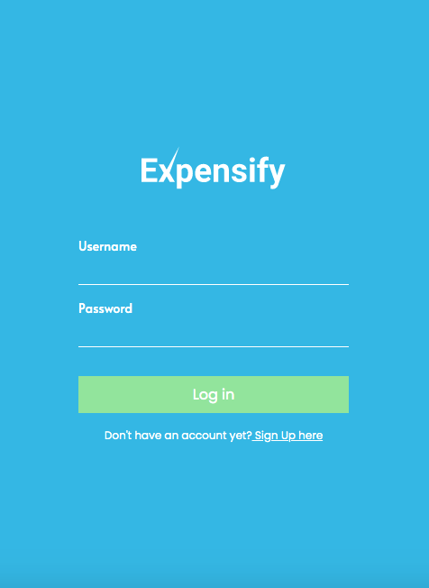
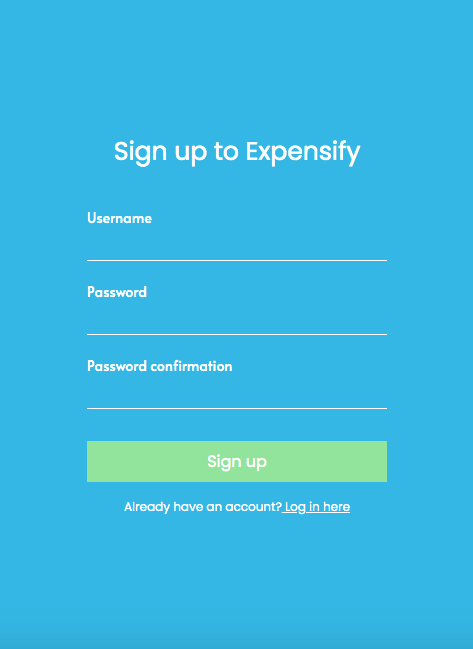
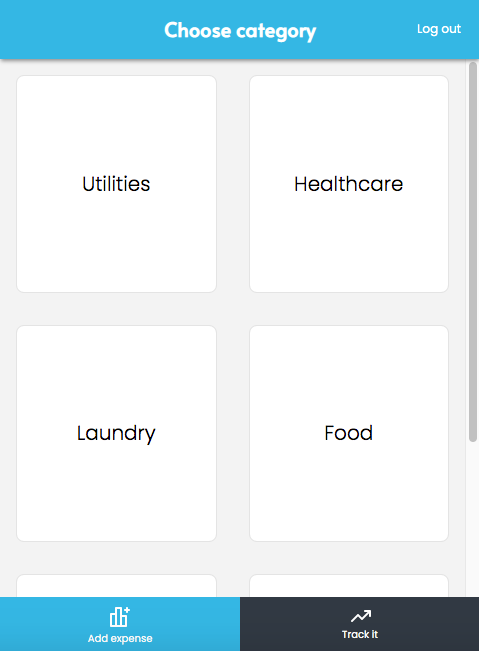
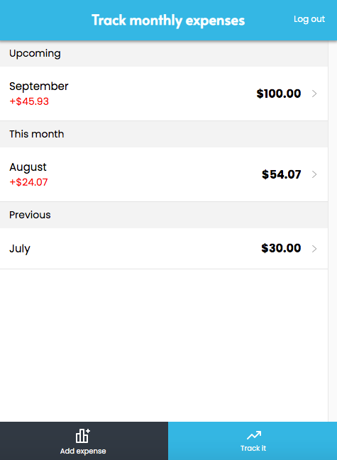

  

# Description

> Expensify is a mobile-first web application built using React & Redux that helps users keep track of daily expenses to monitor their monthly cost of living. With expensify, you can add as many expenses as you want for a given date and watch how much you save or overspend per month in the track it page. This application uses React as the frontend framework and Rails for the backend API resources. The backend code base can be found [here](https://github.com/xtrmdarc/expensify).

## Live Demo

### Test user 
- username: admin
- password: 123

[Live Demo Version](https://xtrmdarc-expensify-react.herokuapp.com/)

## Built With

- React
- Redux
- React Router
- JS
- HTML
- CSS
- Node.js
- React-DOM
- React-Create-App
- npm
- ES6

## How to install locally

- Clone this project into your local environment. 
- Run the command `npm install` to install all the required dependencies.
- Run the command `npm start`
- Open [http://localhost:3000](http://localhost:3000) to view it in the browser.

## Available Scripts

In the project directory, you can run:

### `npm start`

Runs the app in the development mode. 
Open [http://localhost:3000](http://localhost:3000) to view it in the browser.

The page will reload if you make edits. 
You will also see any lint errors in the console.

### `npm test`

Launches the test runner in the interactive watch mode. 
See the section about [running tests](https://facebook.github.io/create-react-app/docs/running-tests) for more information.

### `npm build`

Builds the app for production to the `build` folder. 
It correctly bundles React in production mode and optimizes the build for the best performance.

The build is minified and the filenames include the hashes. 
Your app is ready to be deployed!

## Potential Future Features

- Expense category segrettion on a detail page
- Web responsive design
- Dashboard to add more categories

## Authors

👤 **Diego Antonio Reyes Coronado**

- Github: [@xtrmdarc](https://github.com/xtrmdarc)
- Twitter: [@diegoreyesco](https://twitter.com/DiegoAn91629127)
- Linkedin: [diegoreyesco](https://www.linkedin.com/in/diego-reyes-coronado)

## 🤝 Contributing

Contributions, issues, and feature requests are welcome!

Feel free to check the [issues page](https://github.com/xtrmdarc/expensify-frontend/issues).

## Show your support

Give a ⭐️ if you like this project!
